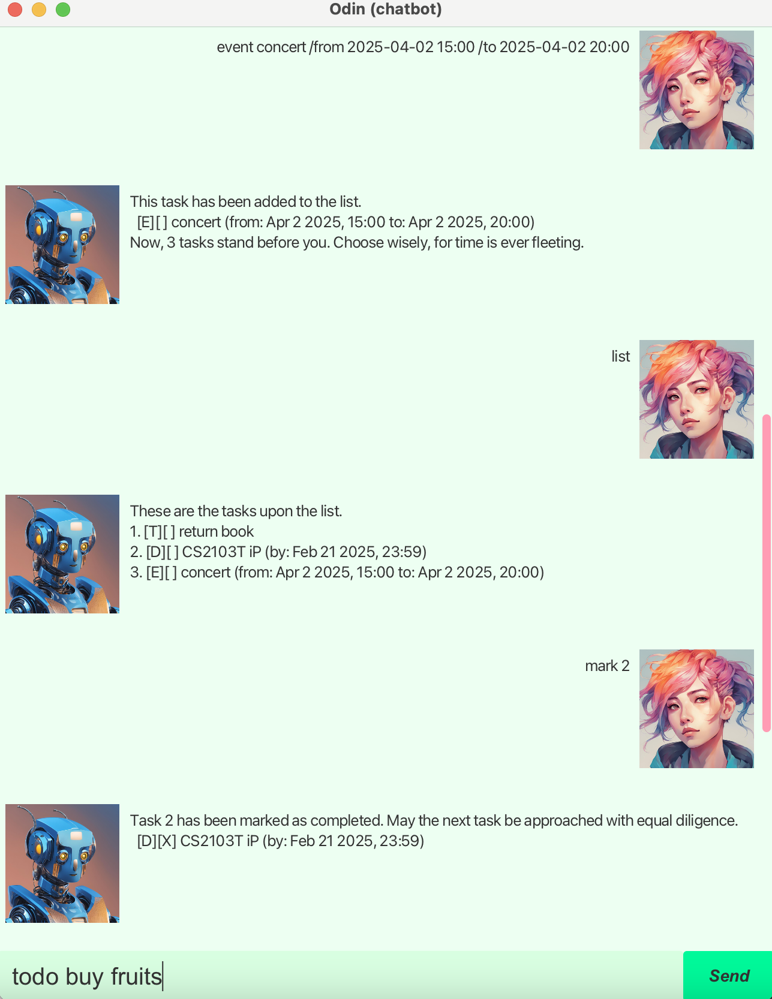

# Odin User Guide

Odin is a **desktop chatbot application designed for task and event management**,
combining the efficiency of a Command Line Interface (CLI) with the advantages of a Graphical User Interface (GUI).

# Features & Commands

- [Adding a to-do](#adding-a-to-do-todo)
- [Adding a deadline](#adding-a-deadline-deadline)
- [Adding an event](#adding-an-event-event)
- [Listing all entries](#listing-all-entries-list)
- [Marking an entry](#marking-an-entry-mark)
- [Unmarking an entry](#unmarking-an-entry-unmark)
- [Deleting an entry](#deleting-an-entry-delete)
- [Finding an entry by name](#finding-an-entry-by-name-find)
- [Undoing the previous command](#undoing-the-previous-command-undo)
- [Exiting the program](#exiting-the-program-exit)
- [Automatic saving](#automatic-saving-feature)

> [!NOTE] General notes on command formatting:
> - Words in UPPER_CASE are the parameters to be supplied by the user, which can contain non-empty keywords separated by spaces.
>   e.g. in `todo TASK`, `TASK` is a parameter which can be used as `TASK assignment` or `TASK return a book`. `TASK ` (empty keyword) is not allowed.
> - Parameters must be given in the specified order.
>   e.g. in `event EVENT /from START-DATE /to END-DATE`, `event party /to 2025-10-10 /from 2025-10-09` is **not** accepted.
> - Providing extra parameters is **not** allowed.
> - Extraneous spaces are ignored. Spaces before or after keywords are removed, and multiple spaces between keywords are treated as a single space.
> - Command names are **not** case-sensitive, but other keywords are.
>   e.g. in `deadline TASK /by DATE`, `Deadline assignment /by 2025-01-01` and `dEADliNE assignment /by 2025-01-01` are allowed, but `deadline assignment /BY 2025-01-01` is not.
> Also, `deadline assignment /by 2025-01-01` and `deadline Assignment /by 2025-01-01` have different effects.
> - When a given input does not follow the correct format, an error message is displayed, and the task list remains unchanged.

## Adding a to-do: `todo`

Adds a to-do task to the task list.

Format: `todo NAME`

Examples:

- `todo assignment`
- `todo read linear algebra textbook`

## Adding a deadline: `deadline`

Adds a task with a specific deadline to the task list.

Format: `deadline NAME /by DATE`

Constraints:

- `DATE` must follow the format of either `YYYY-MM-DD`, `YYYY-MM-DD HH:MM`, or `YYYY-MM-DD HH:MM:SS`.

Examples:

- `deadline CS2103T iP /by 2025-02-21`
- `deadline CS2103T iP /by 2025-02-21 23:59`
- `deadline CS2103T iP /by 2025-02-21 23:59:59`

## Adding an event: `event`

Adds an event with a specific start date and end date.

Format: `event NAME /from START-DATE /to END-DATE`

Constraints:

- `START-DATE` and `END-DATE` must follow the format of either `YYYY-MM-DD`, `YYYY-MM-DD HH:MM`, or `YYYY-MM-DD HH:MM:SS`.

Examples:

- `event career festival /from 2025-04-01 /to 2025-04-04`
- `event BBQ /from 2025-05-02 17:00 /to 2025-05-02 21:00`

## Listing all entries: `list`

Shows a list of all entries in the task list.
The following data is shown for each entry:

- Index
- Name
- Deadline, start date, and end date (if any)
- Whether it is marked as done

Format: `list`

## Marking an entry: `mark`

Marks an entry (to-do, deadline or event) as done.
The entry must be specified by its index in the task list.

Format: `mark INDEX`

Constraints:
- `INDEX` is an integer from 1 to the size of task list, both inclusive.
- The specified entry must not already be marked before performing this operation.

Examples:

- `mark 2`

## Unmarking an entry: `unmark`

Removes the completed status from an entry (to-do, deadline, or event).
The entry must be specified by its index in the task list.

Format: `unmark INDEX`

Constraints:
- `INDEX` is an integer from 1 to the size of task list, both inclusive.
- The specified entry must already be marked before performing this operation.

Examples:

- `unmark 3`

## Deleting an entry: `delete`

Deletes an entry (to-do, deadline or event) from the task list.
The entry must be specified by its index in the task list.

Format: `delete INDEX`

Constraints:
- `INDEX` is an integer from 1 to the (current) size of task list, both inclusive.

Examples:

- `delete 1`

## Finding an entry by name: `find`

Finds all entries (to-do, deadline or event) whose names contain the given keywords.

Format: `find KEYWORDS`

Details:

- `KEYWORDS` is case-sensitive.
- If `KEYWORDS` consists of multiple words, it matches an entry only if the entry contains the exact sequence of words, separated by a single space, in the same order.
  e.g. `read book` matches `read books of history`, but not `read history books` or `book read`.

Examples:

- `find assignment`
- `find read book`

## Undoing the previous command: `undo`

Reverts the effect of the most recent *successful effective command*.

Successful effective command is a command that successfully changed the state of task list;
 i.e. commands that were executed without any errors, whose command type is either `todo`, `deadline`, `event`, `mark`, `unmark`, or `delete`.

For example, if the most recent successful effective command was `todo`, the added to-do task will be deleted;
if the most successful effective recent command was `mark`, the marked entry will be unmarked.

Format: `undo`

Details:

- The most recent not-yet-reverted successful effective command is reverted.
 (Explanation for those who are familiar with technical terms: all successful effective commands are stored in a stack.
When this command is used, the most recent command at the top of the stack is removed, and its effect is reverted.)
- An error is displayed when there are no commands to be reverted.
- It is impossible to revert the effect of this `undo` command itself.

## Exiting the program: `exit`

Exits the program.

## Automatic saving

The Task list is automatically saved to a local file (`./src/data/records.txt`) when the application exits.
The saved task list is automatically restored when the application is reopened.

# Credit

- [Canva AI Image Generator](https://www.canva.com/ai-image-generator/) is used to generate images for the icons of chatbot and user displayed in the GUI.
- [ChatGPT](https://chatgpt.com) is used to correct and refine the grammar of this user guide.